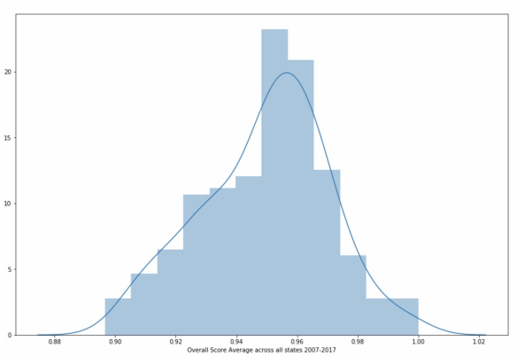
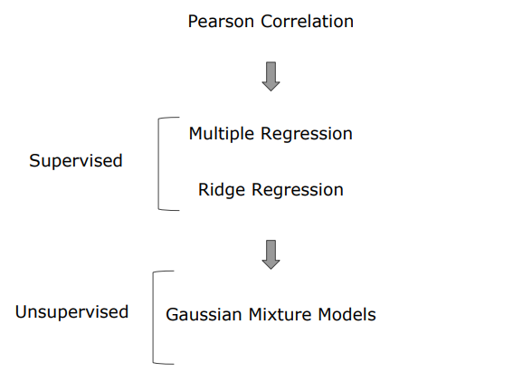
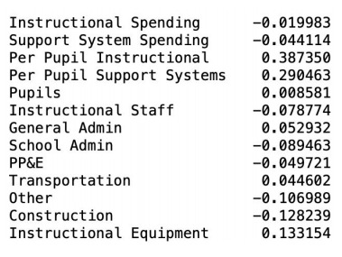
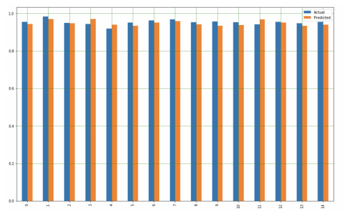
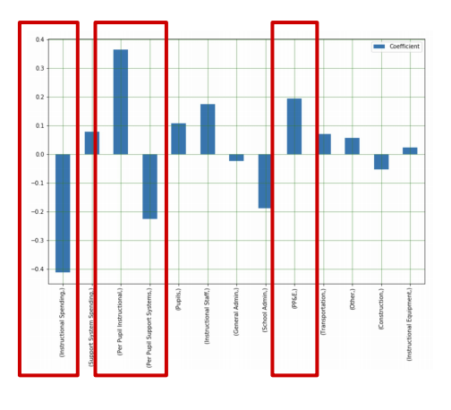
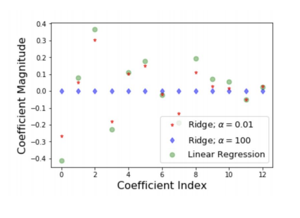
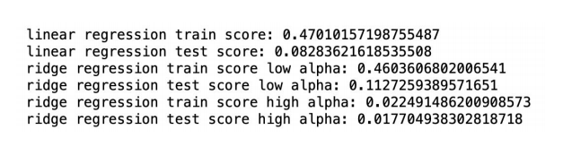
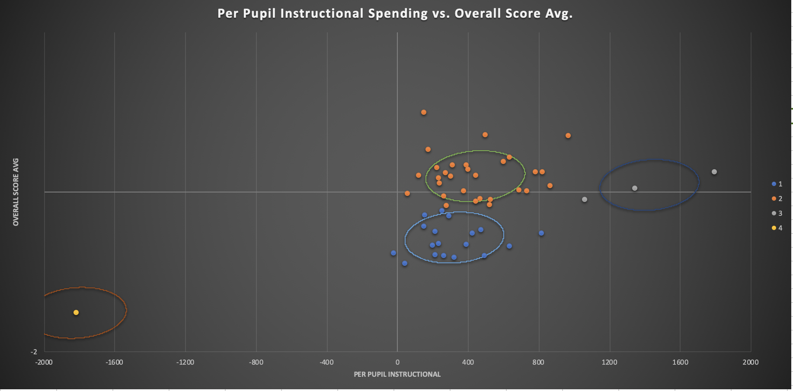

# Return on Financial Investment in American Public School Systems
## Chase Yarbrough, Jinyoung Eum, Ved Mohan

### Introduction
Education is a pillar of society that factors into decisions with a variety of scopes with both short term and long term implications. A strong public education system has resounding implications ranging from which district families chose to settle in, adjacent property valuations, and larger more abstract relationships such as the financial growth of countries in the long run.

#### Motivation
Given a limited amount of funding each year, state and federal administrations are tasked with investing in various aspects of public education in order to improve the overall quality of learning.
Our goal was to create a tool which demonstrates which areas to target spending and investments in order to receive the highest return on education quality.

#### Problem Statement
X dollars invested in Y area will result in an average increase in educational performance by Z.

### Data
Two different sources of data were used, testing data and financial data

#### Test Data
Test score data from  National Assessment of Educational Progress (NAEP testing). NAEP has been selected as it is a standardized test administered at two grade levels, 4th grade and 8th grade. There are two different scores, measuring Math and English performance.

Some characteristics of this data:
1. Test scores are available biyearly in each state from 2007 to 2017.
2. Tests were given to 4th and 8th graders in Math and Reading and the average score by state is used.
3. For 8th graders the average math test score is 282 and the average reading test score is 265.
4. For 4th graders the average math test score is 240 and the average reading test score is 221.

To see the complete dataset source: 
* https://nces.ed.gov/nationsreportcard/

#### Financial Data
Financial data was sourced from the United States Census. Data between 2008 and 2017 tracked individual areas of investment on a state by state basis. The categories were as follows:

* Salaries and Wages
* Employee Benefits
* Pupil Support Services
* Staff Support Services
* General Administration
* School Administration
* Operation and Maintenance of plant
* Pupil Transportation
* Other

ENTER SNAPSHOT OF DATA HERE

To see the complete dataset source: 
* https://www.census.gov/data/tables/2008/econ/school-finances/secondary-education-finance.html

#### Dividing Further into the Dataset
"

### Our Approach
We intend to perform a linear regression on aspects of each school system’s financing as well as the past year’s test scores against the current test scores to give an overall predictive formula for the change in a school’s performance based on differences in a state’s financial plan.
"

#### Procedure
A preliminary check was done using a Pearson Correlation test. This purpose of this test is to check the correlation between individual factors and Overall Score Average, and we can note that we see the highest correlation factor in Per Pupil Instructional Spending.

"

#### Supervised

From our inital correlation checks, we wanted to move on to some more robust methods that could help us take a closer look at our problem statement: X dollars invested in Y area will result in an average increase in educational performance by Z. The majority of such a question lies under the category of Supervised Learning, and within Supervised Learning we will be looking at Multiple Linear Regression and Ridge Regression.

## Mulitple Linear Regression

Before preforming our 

"
"

## Ridge Regression
"
"

#### Unsupervised
"
.png)"
.png)"
.png)"

#### Conclusion

* Supervised Learning
  We saw that Per Pupil Instructional Spending and PP&E were the two most positivly correlated features in our overall model, and Per       Pupil Support Spending and Instructional Spending were our two most negativly correlated features. If the core of our question is       which areas of spending are the best investment for school systems, this is the core of our answer.
  
* Unsupervised Learning
  Our Gaussian Mixture Models showed clear clusters of large, high spending states in metrics that were not taken at a per pupil              level. It may be interesting to build on this project in a future study which takes the Census' publically released data and            attempts to answer the same question using only converted, per pupil metrics.
  
